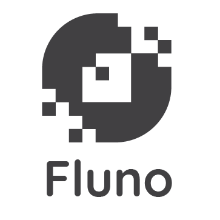

# Flunoプログラミング言語

<div align="center">
  
  <p>
    <strong>Probabilistic, Reactive, and Differentiable Programming for Autonomous Systems</strong>
  </p>
  <p>
    <a href="documents/Fluno_Book/README.md">ドキュメント</a> |
    <a href="documents/fluxver2.md">仕様書</a>
  </p>
</div>


[](https://github.com/soichiro121/Fluno-lang/releases/latest)
---

**Fluno** は、確率型プログラミング、リアクティブプログラミング、微分可能プログラミングを特徴として作成された言語です。
これによって、ロボティクスなどの分野で簡潔かつ効率的なプログラムを作成することができます。

## 主な特徴
### 確率型プログラミング
### リアクティブプログラミング
### 微分可能プログラミング
### メモリ管理システム

## ドキュメント

Flunoの学習には、公式ガイドブック **[The Fluno Programming Language](documents/Fluno_Book/README.md)** を参照してください。

## セットアップ

### 必要要件
*   Rust 1.70 以上
*   Cargo

### インストール
ソースコードからビルドします。

```bash
git clone https://github.com/soichiro121/Fluno-lang.git
cd Fluno-lang
cargo build --release
```

### 実行

## 開発ステータス

## 貢献

バグ報告、機能提案、プルリクエストを歓迎します！

## ライセンス

This project is licensed under the MIT License - see the [LICENSE](LICENSE) file for details.
